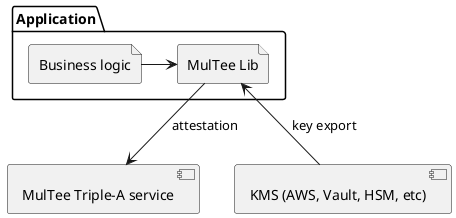
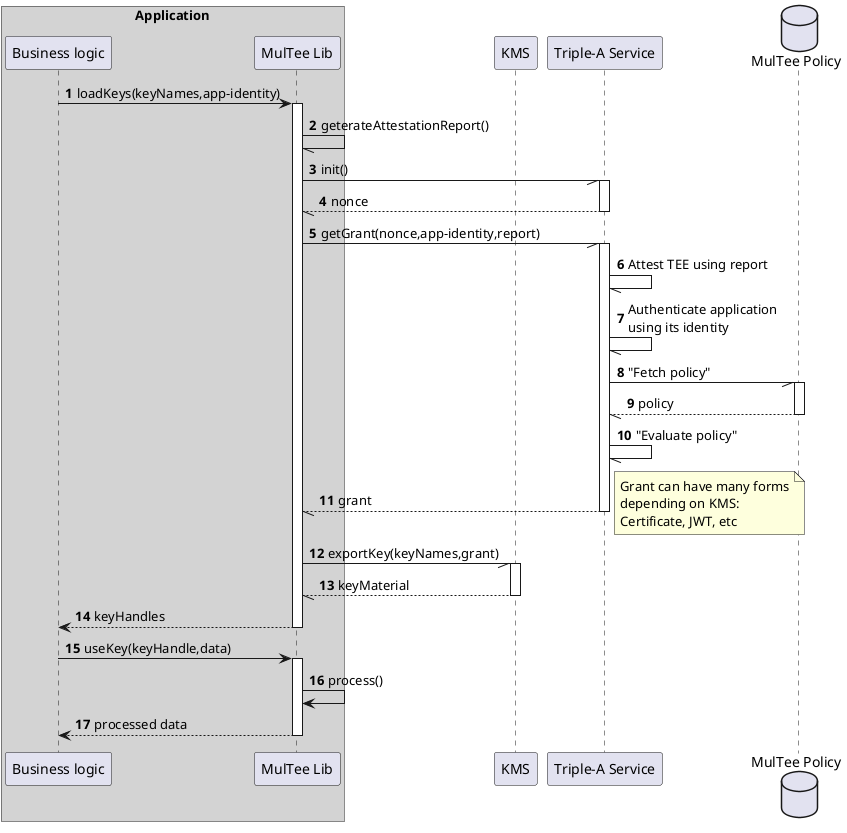
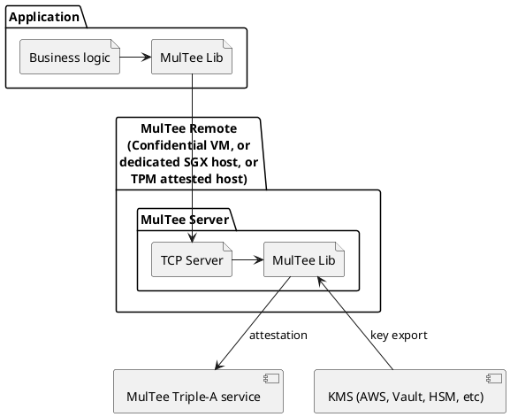
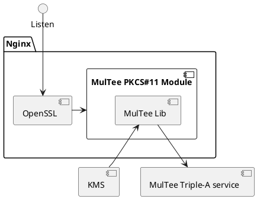

<!-- TOC -->
* [Intro](#intro)
  * [Goals](#goals)
  * [Non-goals](#non-goals)
* [Architecture](#architecture)
  * [Interaction between components, logical](#interaction-between-components-logical)
  * [Interaction between components, MulTee Remote deployment](#interaction-between-components-multee-remote-deployment)
  * [Interaction between components, Nginx deployment](#interaction-between-components-nginx-deployment)
  * [Elements of MulTee Lib](#elements-of-multee-lib)
  * [Elements of MulTee Core](#elements-of-multee-core)
  * [Kubernetes deployment](#kubernetes-deployment)
* [Comparison](#comparison)
  * [Comparison with LibraryOS (Graphene/Gramine, Occulum,SCONE,Fortanix Rust Enclave Development Platform)](#comparison-with-libraryos-graphenegramine-occulumsconefortanix-rust-enclave-development-platform)
  * [Comparison with CoVM](#comparison-with-covm-)
    * [Lightweight VMs](#lightweight-vms)
    * [Standalone VMs](#standalone-vms)
* [Implementation details](#implementation-details-)
  * [Language wrappers](#language-wrappers-)
  * [Components](#components)
    * [Common](#common)
    * [KMIP](#kmip)
    * [Core](#core)
    * [Library](#library)
    * [Java interface](#java-interface)
    * [GoLang interface](#golang-interface)
    * [PKCS#11 interface](#pkcs11-interface)
    * [MulTee-server](#multee-server)
    * [Triple-A service](#triple-a-service)
    * [Intel SGX interface](#intel-sgx-interface)
    * [PyKMIP](#pykmip)
    * [Samples](#samples)
* [Testing](#testing)
* [Performance](#performance-)
    * [Throughput](#throughput)
    * [Latency](#latency)
* [Attestation](#attestation)
  * [SGX attestation](#sgx-attestation)
  * [SGX DCAP attestation](#sgx-dcap-attestation)
  * [SEV-SNP attestation](#sev-snp-attestation)
  * [CoVM attestation (DCAP, and SEV-SNP)](#covm-attestation-dcap-and-sev-snp)
  * [TCG aka TPM attestation](#tcg-aka-tpm-attestation)
  * [TOFU attestation](#tofu-attestation)
* [MulTee Lite](#multee-lite)
* [Application credentials package (ZIP file)](#application-credentials-package-zip-file)
* [Security of Triple-A Service](#security-of-triple-a-service)
* [Secret Caching and Credentials Pinning](#secret-caching-and-credentials-pinning)
* [Key Use Policy aks Triple-A Policy](#key-use-policy-aks-triple-a-policy)
* [Higher Level Policy Layer (HLPL)](#higher-level-policy-layer-hlpl)
* [Audit/Logging](#auditlogging)
* [Glossary of terms](#glossary-of-terms)
* [Maintenance and support](#maintenance-and-support)
<!-- TOC -->

# Intro
MulTee is a POC of multi-platform approach to data-in-use protection using Confidential Computing. 
The approach allows to provide strong assurances of sensitive data confidentiality and integrity without need to review/validate entire application. 
This allows for separation of responsibilities between business logic and privacy/security teams. 
MulTee can also be sen as an exercise in TCB minimization (caveats below).
Compact yet very useful example of data-in-use protection is protection of DEKs. 
More extensive example, utilizing policy engine, concerned with privacy protection is outlined below
The repository contains set of components which can be combined to provide all supported functionality on all supported deployment

## Goals
* Implement usable high-performance "HSM accelerator".
* Provide Crypto-abstraction which minimizes chance of mistake or abuse by developers and admins.
* Developer friendliness - ability to compile/link/test application locally even when developer's platform 
  is very different from target platform. Also, Crypto-abstraction should be easy to use.
* Define how "good" Cryptographic policy could look like. 
## Non-goals
* Ultimate performance. There multiple potential optimization targets: latency for small work units, 
  throughput for medium and large work units, protection against side-channel attacks, minimization of overhead of library and/or server, etc. 
  They are difficult to address all at once, as some are contradictory. At the same time it's straightforward to optimize for specific use-case.
* TODO


# Architecture
Major high level components consist of
* **KMS** - Third party Key Management Service responsible for basic key management functions, and major pieces of Key Use Policy
* **MulTee Lib** - the library applications link with. Can take multiple shapes: Java Jar, Go Mod, PKCS#11 shared library module, etc
* **MulTee Triple-A Service** - Attestation, Authentication and Authorization. Performs attestation of TEE (runs approved MulTee code on allowed TEE), authenticates application identity and authorizes use of DEKs by issuing grant acceptable by corresponding KMS.
* (optional) **MulTee Server** - deployed in combination with certain flavors of TEEs to perform operation remotely. Itself is based on MulTee Lib. May augment elements of policy not supported in KMS, enforced by MulTee Lib inside TEE.

## Interaction between components, logical

It also directly corresponds to SGX TEE.


<details><summary>PlantUML</summary>


</details>

Triple-A - Attestation, Authentication and Authorization flow.


<details>
<summary>PlantUML</summary>


</details>

## Interaction between components, MulTee Remote deployment

This is very high-level depiction. More specific diagrams, for instance for Kubernetes can be found below.

Attestation only applies to MulTee Server. Application identity and some other missing parameters are passed through by MulTee Lib embedded in the application.


<details><summary>PlantUML</summary>


</details>

## Interaction between components, Nginx deployment


<details><summary>PlantUML</summary>


</details>

## Elements of MulTee Lib


Note that MulTee Lib contains more than one instance of MulTee Core.
One is SGX specific and another one which can be used within other types of TEEs.

## Elements of MulTee Core


In this repository MulTee Core contains KMIP library as KMS client.
Other types of KMS clients, beside KMIP, have been implemented too.   
Core, which needs to be SGX compatible, have been implemented in multiple ways:
* Rust with custom "std" (sysroot). Using [Teaclave SGX SDK](https://github.com/apache/incubator-teaclave-sgx-sdk)
* Rust no_std
* C/C++

Custom "std" is the approach used in this repo

## Kubernetes deployment
SGX


CoVM (Intel TDX, AMD SEV-SNP) over TCP/IP or Unix socket


# Comparison

SGX came up in millions end-user devices.
Access to SEV/TDX requires effort

## Comparison with LibraryOS ([Graphene/Gramine](https://github.com/gramineproject/gramine), [Occulum](https://github.com/occlum/occlum),[SCONE](https://sconedocs.github.io/),[Fortanix Rust Enclave Development Platform](https://github.com/fortanix/rust-sgx))

1. LibraryOSes' security boundary is OS process, which means may cancel benefits of TEE. That may happen, for instance, when application is linked with vulnerable library, think OpenSSL Heartbleed, etc. 
   MulTee is only concerned narrow security control, for instance data protection, privacy or sovereignty, etc.    
2. LibraryOSes are relatively big platforms, supported by community and/or vendor.
   If security target of the community/vendor if higher than target of particular project,
   the project can rely on what's provided. If projects has independent/higher security target, 
   security review of the platform and the application requires significant effort.
   Changes in how applications interact with OS may require changes in LibraryOS, which requires continuous support by community/vendor 
   MulTee is compact, and can be reviewed/maintained my minimal team. Additionally, reviews of MulTee and application are independent.   
3. Application still requires modifications, which may introduce incompatibilities. Debugging may be non-representative, etc
4. Fortanix EDP only supports with Rust applications.  

## Comparison with CoVM 

Major advantage of CoVMs: much simpler to debug and troubleshoot vs SGX enclave. Application is truly unmodified.

There are several flavors of CoVMs. Among them:
* **standalone VMs** running general-purpose OS
* **lightweight VMs** running little more than application process, such as Confidential-K8s with Kata Containers, etc

### Lightweight VMs
1. Similarly to [LibraryOS](#comparison-with-libraryos-graphenegramine-occulumsconefortanix-rust-enclave-development-platform)#1, vulnerable library may cancel benefits of TEE.
### Standalone VMs
1. Similarly to [LibraryOS](#comparison-with-libraryos-graphenegramine-occulumsconefortanix-rust-enclave-development-platform)#1, vulnerable library may cancel benefits of TEE.
2. Constructing secure/locked down instances is hard.
3. There is temptation to open convenience services, such as SSH, to simplify troubleshooting, and vulnerability patching.
   This makes remote attestation meaningless. With MulTee, because scope of sensitive data can be well well-defined,
   it's possible to address troubleshooting concern. There existed a prototype functionality for MalTee to have this be 
   policy controlled - troubleshooting access is only granted (client SSH-certificate signed, etc.)
   _after_ sensitive data is masked, cached secrets removed, and re-attestation is prevented.
   And no privileged access to data needs to be provided.    
   
# Implementation details 

## Language wrappers 

Constants and Error codes are uniform across all languages and libraries.
There is single source of truth in Rust.
Enumerations for Java and GoLang are generated during build. 

## Components
### Common
* ./common

Enumerates all MulTee-specific errors
### KMIP
* ./kmip

TTLV serialization and KMIP enumerations and operations.
Only limited subset is implemented needed to support interaction with KMIP KMS as well as to perform remote cryptographic operations.
### Core
* ./multee-core

Performs cryptographic operations. Contains KMIP client and Triple-A service client. Other clients, such as Hashicorp Vault or other REST or XML based KMS or attestation services can be (have been) implemented.
### Library
* ./multee-lib

The main internal abstraction utilized by all language frontends and PKCS#11.
### Java interface
* ./multee-jni
* ./multee-java

Consists of JNI layer on top of multee-lib and Java abstraction
### GoLang interface
* ./multee-cgo
* ./multee-golang

Consists of CGo FFI layer on top of multee-lib and Go abstraction
### PKCS#11 interface
* ./multee-pkcs11

Limited subset of PKCS#11 needed to support Nginx TLS termination using RSA and ECC keys with hot key rotation (without restart of Nginx).
Built on top of multee-lib
### MulTee-server
* ./multee-server

Uses multee-core either directly (when used with SEV-SNP,TDX, Nitro or TPM) or in SGX enclave form to perform remote cryptographic operations.
Application identity pass-through, KMS policy or Triple-A policy enforcement are not part of this release.
### Triple-A service
* ./triple-a-service

Attestation, Authentication and Authorization service - performs attestation of remote TEE,
authenticates emote application using the TEE, authorizes use of key, which manifests in issuance of key usage grant.
### Intel SGX interface
* ./trusted-sgx
* ./untrusted-sgx

When run in Intel SGX mode provides enclave interface between multee-core and multee-lib.
Depends on nightly Rust. Trusted MulTee Core needs to be signed before being incorporated with untrusted.
Makefile implements only non-prod signing.
### PyKMIP
* ./images/pykmip

[PyKMIP](https://github.com/OpenKMIP/PyKMIP) is used in tests to represent KMS. Has some limitations. Notably: doesn't support ECDSA keys; when used for remote crypto, doesn't support signing "digested data", i.e. hash. 
### Samples
* ./sample/golang
* ./sample/java

Examples of usage of MulTee Language Wrappers. Participate in end-to-end tests 

# Testing
Build and test steps are captured in Makefile.
Make is used primarily for auto-completion convenience, rather than production build script.
For instance production enclave signing step is omitted, etc.

Prerequisites
* Podman or Docker
* make
* Assorted utilites like sed, curl. etc

Build and tests can be run in containers. By default, podman is used, and can be overridden with docker as follows:  
```bash
make container-images PODMAN=docker ...
```

After checking-out MulTee repository, prepare
```bash
git submodule init
git submodule update
make container-images
```

### Tests extracted from _conveyance-self-test.bats_

Test Java interface
```bash
make run-build-container SYSROOT_TOUCH= WHAT='make test-java'
```

Test GoLang interface
```bash
make run-build-container SYSROOT_TOUCH= WHAT='make test-golang'
```

Test PKCS#11 module
```bash
make test-pkcs11 SYSROOT_TOUCH=
```

Test TOFU attestation
```bash
make .stop-test-containers SYSROOT_TOUCH=
make .start-pykmip SYSROOT_TOUCH=
make run-build-container SYSROOT_TOUCH= WHAT='make test-tofu-2'

```

Test SGX DCAP attestation
```bash
make .stop-test-containers SYSROOT_TOUCH=
make run-build-container SYSROOT_TOUCH= WHAT='make .build-triplea-service publish-golang .build-go-sample'
make .start-pykmip .start-triplea SYSROOT_TOUCH=
make run-build-container SYSROOT_TOUCH= WHAT='make test-triplea-dcap'
```

Test SEV-SNP attestation
```bash
make .stop-test-containers SYSROOT_TOUCH=
make run-build-container SYSROOT_TOUCH= WHAT='make .build-triplea-service publish-golang .build-go-sample'
make .start-pykmip .start-triplea SYSROOT_TOUCH=
make run-build-container SYSROOT_TOUCH= WHAT='make test-triplea-sevsnp'
```

Test MulTee Server
```bash
make .stop-test-containers SYSROOT_TOUCH=
make run-build-container SYSROOT_TOUCH= WHAT='make multee-server publish-golang .build-go-sample'
make .start-multee-server SYSROOT_TOUCH=
make run-build-container SYSROOT_TOUCH= WHAT='make test-multee-server'
```

# Performance 

### Throughput
Throughput is determined by balance of multiple factors, 
such as resistance to side-channel attacks, code readability, portability and maintainability (amount of handwritten assembly), etc.
MulTee uses MbedTLS whose performance has been sufficient for all encountered use cases. 

### Latency
Roughly speaking, without pipelining and/or SGX "switchless" mode,
```
latency = 1/throughput + overhead
```

* MulTee-server can do over 90K ops/s per connection/thread.   
* Multee with SGX can do few hundred thousands ops/s per core. With up to 3M ops/s possible using "switchless" enclave interface.

With RSA and ECDSA latency is close to 1/throughput, because throughput is relatively low, and overhead is relatively low.

# Attestation
## SGX attestation
Original Intel EPID requires Intel API available for every attestation. EOL is on [4/2/2025](https://www.intel.com/content/www/us/en/developer/articles/technical/software-security-guidance/resources/sgx-ias-using-epid-eol-timeline.html)
## SGX DCAP attestation
Requires contacting Intel API at least once for every platform/TCB combination.
For testing purposes, on platforms which are not DCAP enabled, MulTee Core will use dummy attestation report,
which attestation service can choose to accept to grant access to non-prod keys.
## SEV-SNP attestation
There are two flavors: VCEK and VLEK. With VCEK, leaf certificate contains ChipID, which may be undesirable, 
or insufficient in some cases to assure platform. With VLEK, ChipID can be disabled, with leaf certificate containing essentially ID if Cloud Service Provider.
For testing purposes, on platforms which are not SEV-SNP enabled, MulTee Lib will use dummy attestation report,
which attestation service can choose to accept to grant access to non-prod keys.
## CoVM attestation (DCAP, and SEV-SNP)
Can be done in numerous ways, one of which is: 
* attestation report with launch measurement of (OVMF firmware, paravizor/SVSM with embedded ephemeral TPM).
* if firmware and paravizor/SVSM is trusted, then TCG/TPM attestation of subsequent boot and (optionally) OS+application can be trusted

There are drawbacks
* really two composed attestations;
* if root filesystem _is_ mounted, and _is not_ integrity protected, the TCG/TPM attestation becomes very complex;     
* can HW TPM be passed through into such a machine? If not, as discussed below, TPM cannot be used for replay attack 
  protection and other policy enforcement. If VM/OS supports more than one TPM, many things may become ambiguous and
  confusing. TPM locality, reboot count, etc    

## TCG aka TPM attestation

* Today many platforms offer whole memory encryption, which, in combination with TPM based attestation, 
can be seen as offering many of TEE provided protections.
* MulTee support for TPM attestation can be implemented, for organizations whose fleet isn't yet fully TEE compatible,
to facilitate incremental migration. MulTee Server would ideally be part of initrd, and root filesystem not mounted at all.  

## TOFU attestation
Inception was prompted by several concerns over Intel EPID attestation:
1. Doesn't work in totally disconnected environments
2. Requires reliable network
3. Requires high availability of Intel API
4. Requires Intel to still be business (this "kinda" played out already, as EPID API is EOLed)

Implicitly depends on Secret Caching, or, in other words, relies on availability of Key Derivation inside TEE.
Which raises issue of replay attacks, see discussion below. 

# MulTee Lite

* Is a mode of MulTee operation when it's not protected by TEE. Production MulTee Triple-A Service 
will refuse to attest it. 
* Is useful for testing when Triple-A Service is not accessible, or when testing is done on incompatible platform,
  such as Mac-OS.  
* Environment variable MULTEE_LITE=1 forces "lite" mode even with usable TEE. 

# Application credentials package (ZIP file)
Used primarily to store artifacts representing application identity.
Uses standard ZIP format, with MANIFEST.YAML entry describing rest of the contents.
Can also be used to store (sealed or as plaintext)
* pinned credentials
* cached secrets
* TOFU credentials (for instance, CSR, and then signed grant)
* literal DEKs for testing

# Security of Triple-A Service

It is widely understood that KMS service needs to be operated in a secure way. Similarly,
because Triple-A Service is able to issue grants against KMS, Triple-A Service needs to be secured too.
The same is extended to Triple-A Policy. Blockchain based data structures are natural candidates to store the policy.
I.e., Cryptographic-hash backed VCSes with signed commits, etc

Triple-A Service itself can be run in TEE too.
Procedures of bootstrapping of Triple-A Service and establishing trust between Triple-A and KMS, are outside of scope. 

# Secret Caching and Credentials Pinning

Caching may be needed in use-cases when connectivity to KMS and/or Triple-A Service is unreliable. 

Can be implemented using TEE Key Derivation. To protect against replay attacks, generally speaking,
needs trustworthy monotonic counter. TPM can provide monotonic counter. However, there is no trusted-IO between CoVM and TPM. 
Meanwhile, it's still possible to 
* attest TPM from CoVM, then 
* based on the attestation, establish shared secret for TPM Parameter Encryption, then
* seal the shared secret using TEE Key Derivation
* subsequently, only use Parameter Encryption to talk to TPM
* share single HW TPM between multiple CoVMs
 
With that, TPM can be used to  
* to protect against replay attacks against secret caching and credentials pinning
* provide generic monotonic counter
* provide other strong guarantees, for instance ability to decrypt secret at most once, as TPM provided reboot count or time is potentially untrustworthy

POC code of TPM Attestation, Parameter Encryption and "at most once" policy is here [WIP](https://github.com/tpm/)

# Key Use Policy aks Triple-A Policy

Key Use Policy is thought of generalization of RBAC. Where simple RBAC is many-to-many relation between subjects and privileges,
Key Use Policy is multidimensional: individual permission is related to
* Application (subject)
* Operation (privilege)
* Data (object)
* Locality (is only validated on-prem fleet is permitted?, or dedicated pool of the CSP?, or anything?)
* TCP revision
* Time interval (must happen between)
* Authorization (which procedure was followed, who/what participated)
* Rate Limiting (agent:decrypt at most 20 per work shift, application: encrypt only, etc.)
* Caching (whether key can be stored locally, and what level of protection is required)

Specific use-cases can be satisfied with partially implemented policy.  

# Higher Level Policy Layer (HLPL)
MulTee Key Use Policy can be extended to
* be able to evaluate label-based predicates
* perform regulatory mandated callbacks

With HLPL MulTee can provide enforcement of
* data sovereignty, and/or
* privacy

# Audit/Logging

Data Sovereignty, and/or privacy, in some use cases, may require trail of Policy Decisions or 
Operations be kept. If it's done synchronously, latency may be negatively affected.
In addition to logging done by Triple-A, MulTee Server can do certain kinds of logging on behalf of MulTee Lib.

# Glossary of terms

| Term                       | Comment                                                                                                                                                                                                                                                                                                                                                           |
|----------------------------|-------------------------------------------------------------------------------------------------------------------------------------------------------------------------------------------------------------------------------------------------------------------------------------------------------------------------------------------------------------------|
| Confidential<br/>Computing | Set of technologies, often backed by hardware mechanism, to ensure confidentiality, integrity and authenticity of a computation                                                                                                                                                                                                                                   |
| TEE                        | Trusted Execution Environment                                                                                                                                                                                                                                                                                                                                     |
| TCB                        | Trusted Computing Base - set of components essential for security. Trust can be asserted via certification by a regulatory body, formal verification or manual review, etc                                                                                                                                                                                        |
| Enclave                    | Encapsulates confidential code and data associated with application process. Sometimes it's call *trusted* code and data. The process may optionally contain non-confidential (untrusted) code and data.                                                                                                                                                          |
| CoVM                       | Confidential Virtual Machine, i.e. Confidential Computing backed by a virtual machine                                                                                                                                                                                                                                                                             |
| KMS                        | Key Management System                                                                                                                                                                                                                                                                                                                                             |
| KMIP                       | Key Management Interoperability Protocol, provides KMS functionality, as well as remote cryptographic operations à la network attached HSM                                                                                                                                                                                                                        |
| TPM                        | Trusted Platform Module - a secure crypto-processor                                                                                                                                                                                                                                                                                                               |                                                                                          
| TPM remote attestation     | Remote Attestation which uses platform boot-time and (optionally) run-time measurements, impressed into TPM, which can be signed by TPM prove systems state. On physical platforms requires SecureBoot to eliminate possibility of interference by malicious firmware. May also require technologies like Intel TXT or IOMMU to protect against DMA attacks, etc. |                                                                                          
| TCG                        | [Trusted Computing Group](https://trustedcomputinggroup.org/). Among other things, conceived TPM and TPM-based remote attestation                                                                                                                                                                                                                                 |
| DEK                        | Deta Encryption Key - the key used to protect sensitive data                                                                                                                                                                                                                                                                                                      | 
| KEK                        | Key Encryption Key - key, often as part of a hierarchy, used to manage DEK(s). Aka transport key, wrapping key, storage key, root key, etc                                                                                                                                                                                                                        |
| Intel SGX                  | Secure Guard Extensions. The original widely deployed Confidential Computing technology, smallest TCB of all, SGX1 protected even against memory replay attacks. OS support is required, but no elevated privileges are required to be utilized by applications. SGX1 used client privacy oriented remote attestation called EPID                                 |
| DCAP                       | Data Center Attestation Primitives, aka ECDSA attestation - another Intel attestation scheme. It allows for attestation of multi-package platforms. Allows for (limited) offline attestation, and can be used with Intel SGX and Intel TDX TEEs.                                                                                                                  |
| AMD SEV*                   | A family of virtualization technologies supporting memory encryption and remote attestation                                                                                                                                                                                                                                                                       |
| AMD SEV-SNP                | An evolution of AMD SEV, where virtual machine is protected even against hypervisor. Another important change is that remote attestation is initiated by CoVM, and not hypervisor, which allows for asynchronous VM launch.                                                                                                                                       |
| VCEK/VLEK                  | Certificate hierarchies used in remote attestation of AMD SEV-SNP CoVMs.                                                                                                                                                                                                                                                                                          |
| Intel TDX                  | Technology similar to AMD SEV-SNP. Supports Secure Boot, unlike AMD SEV-SNP. Uses DCAP for attestation.                                                                                                                                                                                                                                                           |
| Nitro Enclaves             | Isolation technology (at the moment), available in AWS. Supports remote attestation. Integrated with AWS KMS. Encourages segregation of sensitive part of computation into Nitro enclave.                                                                                                                                                                         |
| ARM CCA                    | Confidential Computing Architecture introduced in ARMv9-A.                                                                                                                                                                                                                                                                                                        |
| ARM TrustZone              | Original ARM security mechanism based on system partitioning (RAM, IO devices, etc).                                                                                                                                                                                                                                                                              |
| TOFU                       | Trust On First Use. If platform is initially trusted, i.e. supply chain and initial provisioning are secure, remote attestation can be replaced by capturing enough of identity of the platform&TEE to later authenticate the TEE running no the platform. Similar to SSH host fingerprint                                                                        |
| CSP                        | Cloud Services Provider                                                                                                                                                                                                                                                                                                                                           |
| HLPL                       | Higher Level Policy Layer                                                                                                                                                                                                                                                                                                                                         |
| VCS                        | Version Control Systems: Git, Mercurial, etc                                                                                                                                                                                                                                                                                                                      |

# Maintenance and support
Currently, Authors have no capacity to provide assistance with MulTee. 